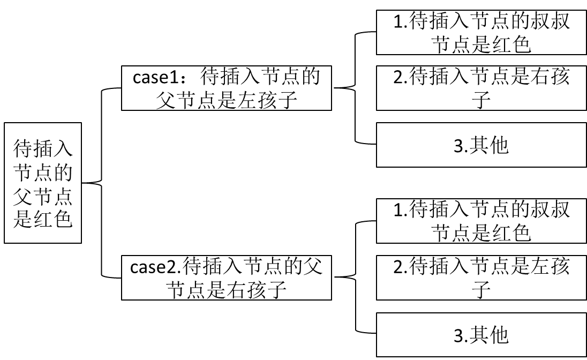
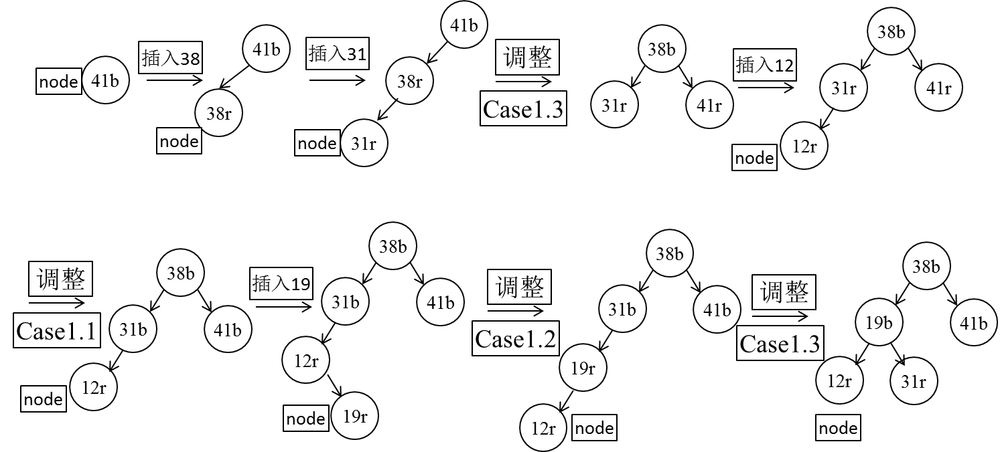
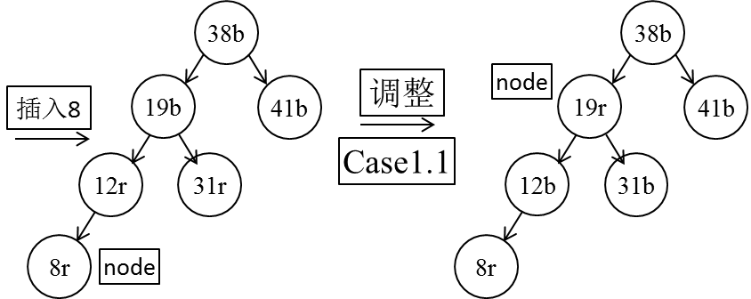

红黑树（参考《算法导论》）
==============

#1.红黑树的性质：#
> (1)每个节点或是红色的，或是黑色的。<br>
> (2)根节点是黑色的。<br>
> (3)每个叶节点是黑色的<br>
> (4)如果一个节点是红色的，则它的两个子节点都是黑色的。<br>
> (5)对每个节点，从该节点到其所有后代叶节点的简单路径上，均包含相同数目的黑色节点。<br>

#2.红黑树的分析#
>首先对红黑树中的节点进行定义，节点的属性应该包含节点的值，颜色，左孩子，右孩子和父节点<br>
>节点的定义：<br>
```Java

class Node<T>{
  private T key;//值
  private char color;//颜色
  private Node<T> left;//左孩子
  private Node<T> right;//右孩子
  private Node<T> parent;//父节点
  Node(){}
  Node(T key,char color, Node<T> left, Node<T> right,Node<T> parent){
    this.key=key;
    this.color=color;
    this.left=left;
    this.right=right;
    this.parent=parent;
  }
  public T getKey(){
    return key;
  }
  public void setKey(T key){
    this.key=key;
  }
  public char getColor(){
    return color;
  }
  public void setColor(char color){
    this.color=color;
  }
  public Node<T> getLeft(){
    return left;
  }
  public void setLeft(Node<T> left){
    this.left=left;
  }
  public Node<T> getRight(){
    return right;
  }
  public void setRight(Node<T> right){
    this.right=right;
  }
  public Node<T> getParent(){
    return parent;
  }
  public void setParent(Node<T> parent){
    this.parent=parent;
  }
}

```

>然后实现红黑树，通过一个节点一个节点插入的方式来构建红黑树<br>
>红黑树定义：包括根节点和构造函数<br>
```Java

private Node<Integer> root;
  RedBlackTree(){}
  RedBlackTree(Node<T> root){
    this.root=(Node<Integer>) root;
}

```

>红黑树：同二叉搜索树的插入一样，先按大小插入待插入的节点<br>
```Java

public void insert(Integer key){
    Node<Integer> node=new Node<Integer>(key,'r',null,null,null);
    if(node!=null){
      insertTree(node); 
    }
  }
  public void insertTree(Node<Integer> z){
    Node<Integer> node=root;
    Node<Integer> parnode=null;
    while(node!=null){
      parnode=node;
      if(z.getKey()<node.getKey())
        node=node.getLeft();
      else
        node=node.getRight();
    }
    z.setParent(parnode); 
    //System.out.println(111);
    if(parnode!=null&&z.getKey()<parnode.getKey()){
      //System.out.println(parnode.getKey());
        parnode.setLeft(z);
        z.setParent(parnode);      
    }
    else if(parnode!=null&&z.getKey()>parnode.getKey()){
        parnode.setRight(z);
        z.setParent(parnode);
    }       
    else{
      root=z;
    }
    insertFixUp(z);//调整
  }

```

>插入待插入节点后，可能会破坏红黑树的性质，所以用insertFixUp(z)函数对此树进行调整，以确保其是红黑树###<br>
>为保证红黑树的性质，所以待插入的节点插入后设置的颜色为红色，所以当插入节点后，需要调整的条件是插入节点的父节点也是红色，这样就违反了性质4，所以需要调整<br>
>在插入节点的父节点是红色的条件下，具体的调整分为以下情况：<br>

>.红黑树的实例分析<br>
>###将关键字41、38、31、12、19、8连续地插入一颗初始为空的红黑树###<br>



>####待插入节点的父节点是左孩子####<br>
```Java
if(node.getParent()!=null && node.getParent().getParent()!=null&& node.getParent()==node.getParent().getParent().getLeft()){
        uncle=node.getParent().getParent().getRight();
        if(uncle!=null&&uncle.getColor()=='r'){
          node.getParent().setColor('b');
          uncle.setColor('b');
          node.getParent().getParent().setColor('r');
          node=node.getParent().getParent();
        }
        else if(node==node.getParent().getRight()&&node.getParent().getRight()!=null){
          node=node.getParent();
          leftRotate(node);
        }
        else{
          node.getParent().setColor('b');
          node.getParent().getParent().setColor('r');
          rightRotate(node.getParent().getParent());
        }
      }
```
>####待插入节点的父节点是右孩子####<br>
```Java

else{
        uncle=node.getParent().getParent().getLeft();
        if(uncle.getColor()=='r' && uncle!=null){
          node.getParent().setColor('b');
          uncle.setColor('b');
          node.getParent().getParent().setColor('r');
          node=node.getParent().getParent();
        }
        else if(node==node.getParent().getLeft()&&node.getParent().getLeft()!=null){
          node=node.getParent();
          rightRotate(node);
        }
        else{
        	node.getParent().setColor('b');
        	node.getParent().getParent().setColor('r');
        	leftRotate(node.getParent().getParent());
        } 
    }

```

>####调整实现的具体代码####<br>
```Java
public void insertFixUp(Node<Integer> node){
    Node<Integer> par,gpar,uncle;
    while(node.getParent()!=null && node.getParent().getColor()=='r'){
      if(node.getParent()!=null && node.getParent().getParent()!=null&& node.getParent()==node.getParent().getParent().getLeft()){
        uncle=node.getParent().getParent().getRight();
        if(uncle!=null&&uncle.getColor()=='r'){
          node.getParent().setColor('b');
          uncle.setColor('b');
          node.getParent().getParent().setColor('r');
          node=node.getParent().getParent();
        }
        else if(node==node.getParent().getRight()&&node.getParent().getRight()!=null){
          node=node.getParent();
          leftRotate(node);
        }
        else{
          node.getParent().setColor('b');
          node.getParent().getParent().setColor('r');
          rightRotate(node.getParent().getParent());
        }
      }
      else{
        uncle=node.getParent().getParent().getLeft();
        if(uncle.getColor()=='r' && uncle!=null){
          node.getParent().setColor('b');
          uncle.setColor('b');
          node.getParent().getParent().setColor('r');
          node=node.getParent().getParent();
        }
        else if(node==node.getParent().getLeft()&&node.getParent().getLeft()!=null){
          node=node.getParent();
          rightRotate(node);
        }
        else{
        	node.getParent().setColor('b');
        	node.getParent().getParent().setColor('r');
        	leftRotate(node.getParent().getParent());
        }     
      }
    }
    root.setColor('b');
  }
```

#3.红黑树的代码实现#
>实现<br>
```Java
import java.util.Stack;
class Node<T>{
  private T key;//值
  private char color;//颜色
  private Node<T> left;//左孩子
  private Node<T> right;//右孩子
  private Node<T> parent;//父节点
  Node(){}
  Node(T key,char color, Node<T> left, Node<T> right,Node<T> parent){
    this.key=key;
    this.color=color;
    this.left=left;
    this.right=right;
    this.parent=parent;
  }
  public T getKey(){
    return key;
  }
  public void setKey(T key){
    this.key=key;
  }
  public char getColor(){
    return color;
  }
  public void setColor(char color){
    this.color=color;
  }
  public Node<T> getLeft(){
    return left;
  }
  public void setLeft(Node<T> left){
    this.left=left;
  }
  public Node<T> getRight(){
    return right;
  }
  public void setRight(Node<T> right){
    this.right=right;
  }
  public Node<T> getParent(){
    return parent;
  }
  public void setParent(Node<T> parent){
    this.parent=parent;
  }
}
class RedBlackTree<T>{
  private Node<Integer> root;
  RedBlackTree(){}
  RedBlackTree(Node<T> root){
    this.root=(Node<Integer>) root;
  }
  public void insert(Integer key){
    Node<Integer> node=new Node<Integer>(key,'r',null,null,null);
    if(node!=null){
      insertTree(node); 
    }
  }
  public void insertTree(Node<Integer> z){
    Node<Integer> node=root;
    Node<Integer> parnode=null;
    while(node!=null){
      parnode=node;
      if(z.getKey()<node.getKey())
        node=node.getLeft();
      else
        node=node.getRight();
    }
    z.setParent(parnode); 
    if(parnode!=null&&z.getKey()<parnode.getKey()){
        parnode.setLeft(z);
        z.setParent(parnode);
    }
    else if(parnode!=null&&z.getKey()>parnode.getKey()){
        parnode.setRight(z);
        z.setParent(parnode);
    }       
    else{
      root=z;
    }
      insertFixUp(z);
  }
  public void insertFixUp(Node<Integer> node){
    Node<Integer> par,gpar,uncle;
    while(node.getParent()!=null && node.getParent().getColor()=='r'){
      if(node.getParent()!=null && node.getParent().getParent()!=null&& node.getParent()==node.getParent().getParent().getLeft()){
        uncle=node.getParent().getParent().getRight();
        if(uncle!=null&&uncle.getColor()=='r'){
          node.getParent().setColor('b');
          uncle.setColor('b');
          node.getParent().getParent().setColor('r');
          node=node.getParent().getParent();
        }
        else if(node==node.getParent().getRight()&&node.getParent().getRight()!=null){
          node=node.getParent();
          leftRotate(node);
        }
        else{
          node.getParent().setColor('b');
          node.getParent().getParent().setColor('r');
          rightRotate(node.getParent().getParent());
        }
      }
      else{
        uncle=node.getParent().getParent().getLeft();
        if(uncle.getColor()=='r' && uncle!=null){
          node.getParent().setColor('b');
          uncle.setColor('b');
          node.getParent().getParent().setColor('r');
          node=node.getParent().getParent();
        }
        else if(node==node.getParent().getLeft()&&node.getParent().getLeft()!=null){
          node=node.getParent();
          rightRotate(node);
        }
        else{
          node.getParent().setColor('b');
          node.getParent().getParent().setColor('r');
          leftRotate(node.getParent().getParent());
        }
      }
    }
    root.setColor('b');
  }
  public void leftRotate(Node<Integer> node){
    Node<Integer> tempnode;
    tempnode=node.getRight();
    node.setRight(tempnode.getLeft());
    if(tempnode.getLeft()!=null){
      tempnode.getLeft().setParent(node);
    }
    tempnode.setParent(node.getParent());
    if(node.getParent()==null){
      root=tempnode;
    }
    else if(node==node.getParent().getLeft()&&node.getParent().getLeft()!=null){
      node.getParent().setLeft(tempnode);
    }
    else{
      node.getParent().setRight(tempnode);
    }
    tempnode.setLeft(node);
    node.setParent(tempnode);
  }
  public void rightRotate(Node<Integer> node){
    Node<Integer> tempnode;
    tempnode=node.getLeft();
    node.setLeft(tempnode.getRight());
    if(tempnode.getRight()!=null){
      tempnode.getRight().setParent(node);
    }
    tempnode.setParent(node.getParent());
    if(node.getParent()==null){
      root=tempnode;
    }
    else if(node==node.getParent().getLeft()){
      node.getParent().setLeft(tempnode);
    }
    else{
      node.getParent().setRight(tempnode);
    }
    tempnode.setRight(node);
    node.setParent(tempnode);
  }
  public void preOrder(){
    preOrder(root);
  }
  public void preOrder(Node<Integer> node){
    if(node!=null){
      System.out.print(node.getKey()+""+(char)node.getColor()+",");
      preOrder(node.getLeft());
      preOrder(node.getRight());
    }
  }
  public void nrinOrder(){
    Stack stack =  new Stack();
    Node<T> node=(Node<T>) root;
    while(node!=null || !stack.isEmpty()){
      while(node!=null){
        stack.push(node);
        node=node.getLeft();
      }
      node=(Node<T>)stack.pop();
      System.out.print(node.getKey());
      node=node.getRight();
    }
  }
}
```

>测试<br>
```Java
public class TestRedBlackTree {
  
  public static void main(String[] args) {
    // TODO Auto-generated method stub
    RedBlackTree<Integer> rbt=new RedBlackTree<Integer>();
    int[] key={41,38,31,12,19,8};
    for(int i=0;i<key.length;i++){
      rbt.insert(key[i]);
    }
    rbt.preOrder();
    System.out.println();
  }
}
```
